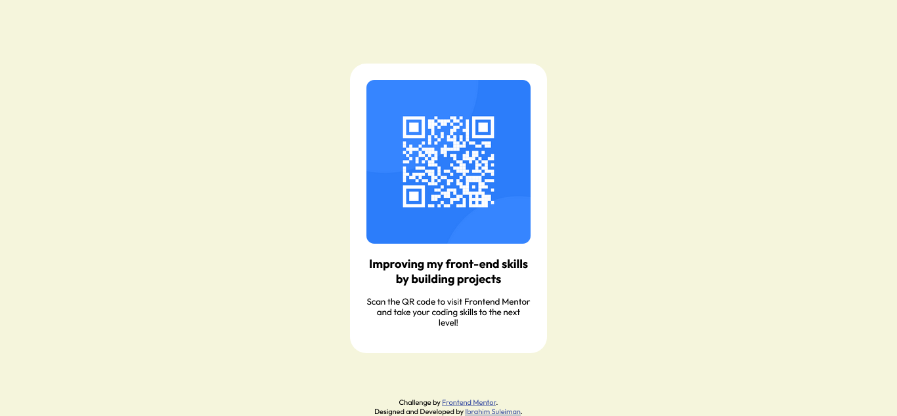

# Frontend Mentor - QR code component solution

This is a solution to the [QR code component challenge on Frontend Mentor](https://www.frontendmentor.io/challenges/qr-code-component-iux_sIO_H). Frontend Mentor challenges help you improve your coding skills by building realistic projects.

## Table of contents

- [Overview](#overview)
  - [Screenshot](#screenshot)
  - [Links](#links)
- [My process](#my-process)
  - [Built with](#built-with)
  - [What I learned](#what-i-learned)
  - [Continued development](#continued-development)
  - [Useful resources](#useful-resources)
- [Author](#author)

## Overview

### Screenshot

Above is a screnshot of my solution for easier access.

### Links

- Solution URL: [Checkout the solution to my qr code challenge here](https://github.com/ebeeraheem/qr-code-frontendmentor.git)
- Live Site URL: [Visit the site by clicking here](https://ebeeraheem.github.io/qr-code-frontendmentor/)

## My process

### Built with

- Semantic HTML5 markup
- CSS custom properties
- Flexbox

### What I learned

I have already learned HTML and CSS previously so I used this project to learn about the git and GitHub ecosystem effectively. I learned a lot by actually doing things to gain handson experience on programming and not just watch others do them in tutorials.

### Continued development

In the future, I would love to try out new challenges offered by Frontend Mentor as I found this to be an effective way to learn.

### Useful resources

- [The Official Git scm docs](https://git-scm.com/docs) - This helped me completed the setup of the git for windows software. It's an incredible way to learn about the git commands and really get started with using it.
- [The official GitHub docs](https://docs.github.com/en/get-started) - This is such a comprehensive guide to using GitHub. I'd recommend it to anyone still learning this concept.

## Author

- Website - [Ibrahim Suleiman](http://ebeesule.carrd.co/)
- Frontend Mentor - [@ebeeraheem](https://www.frontendmentor.io/profile/ebeeraheem)
- GitHub - [@ebeeraheem](https://github.com/ebeeraheem)
